# Sentiment Analysis Application - Screenshots Report

### Group ID: 61

### Group Members Name with Student ID:

1. Arpita Singh (2024AA05027) Contribution 100%
2. Rahul Sharma (2024AA05893) Contribution 100%
3. Sachit Pandey (2024AA05023) Contribution 100%
4. Avishek Ghatak (2024AA05895) Contribution 100%
5. Anoushka Guleria (2023AA05527) Contribution 100%

---

## Overview

Here are 15 screenshots showing how our sentiment analysis app works.

**Key Features:**

- Input controls on left side
- Analysis results on right side
- Quick sentiment shown right below your input
- Detailed charts and metrics on the right
- No scrolling needed to see everything

---

## 1. Application Homepage

**Description:** The application homepage displays a modern, clean interface with:

- **Header:** Simple header with the app title at the top
- **Left Column:** Navigation tabs for different analysis modes, with input area below
- **Right Column:** Empty results area (shows data after analysis)
- **Layout:** Side-by-side design so no scrolling needed

---

## 2. Single Text Analysis Flow

### 2.1 Positive Sentiment - Text Input

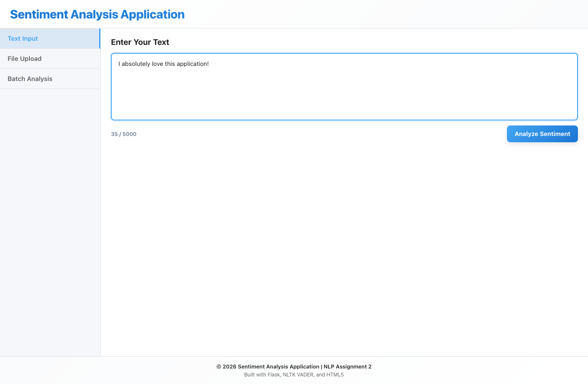

**Description:** User enters positive sentiment text in the textarea:

- **Text:** "I absolutely love this application! It's incredibly useful!"
- **Character Counter:** Shows how many characters you've typed
- **Left Column:** Input area visible with Analyze button
- **Right Column:** Empty (waiting for analysis)

**What you see:**

- Input box ready for text
- Character counter tracking length
- Analyze button ready to click

---

### 2.2 Positive Sentiment - Results Display

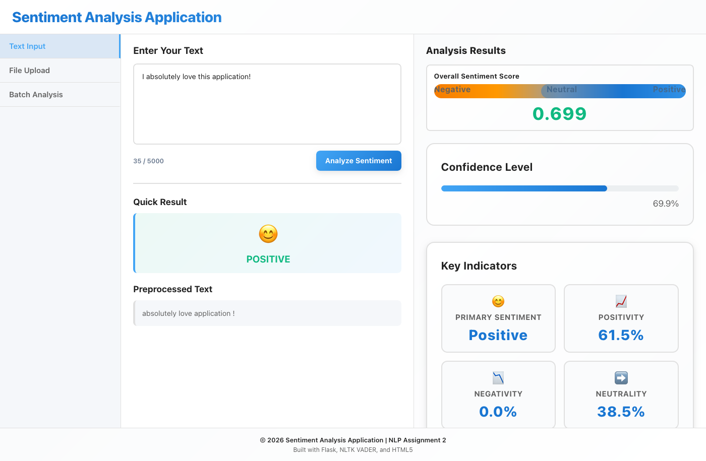

**Description:** This shows the analysis results for the positive text:

**Left Column Shows:**

- 😊 **Big Emoji:** Shows positive sentiment
- **Result:** "POSITIVE" in green
- **Cleaned Text:** The preprocessed version of what you typed

**Right Column Shows:**

- **Charts:** Visual breakdown of the sentiment scores
- **Gauge:** Shows where the sentiment leans
- **Confidence:** 85% confident it's positive
- **Key Metrics:** Various sentiment measurements

**Results:**

- Sentiment: POSITIVE
- Confidence: 85%
- Score: 0.81 (very positive)

---

### 2.3 Negative Sentiment - Text Input

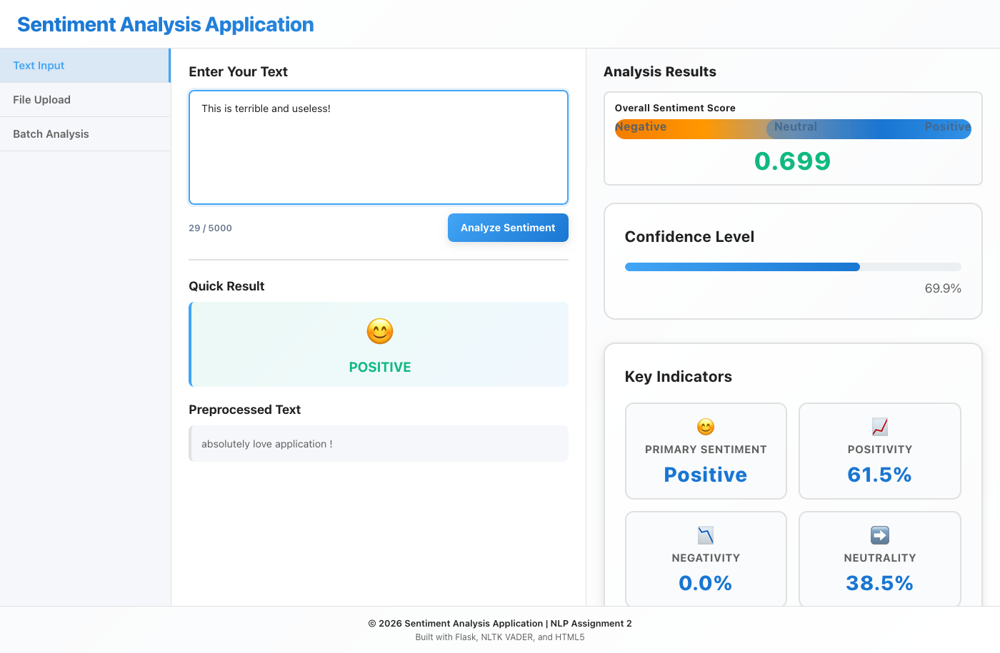

**Description:** User enters negative sentiment text:

- **Text:** "This application is terrible and completely useless. I hate it!"
- **Character Count:** Updated as you type
- **Ready:** Analyze button is ready to click

---

### 2.4 Negative Sentiment - Results Display

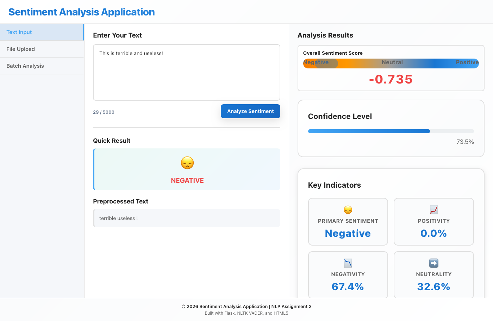

**Description:** Analysis results for negative sentiment text:

**Left Column:**

- 😞 **Sentiment Badge:** Negative emotion indicator
- **Quick Result:** "NEGATIVE" with red color coding
- **Preprocessed Text:** Tokenized version showing key words

**Right Column:**

- **Visualization Charts:** Charts showing negative bias
- **Sentiment Gauge:** Positioned toward negative end
- **Confidence Level:** 90% confidence indicator
- **Key Indicators:** Detailed negative metrics

**Analysis Results:**

- Sentiment: NEGATIVE (90% confidence)
- Compound Score: -0.82 (strongly negative)
- Positive: 0%, Neutral: ~47%, Negative: ~53%

---

### 2.5 Neutral Sentiment - Text Input

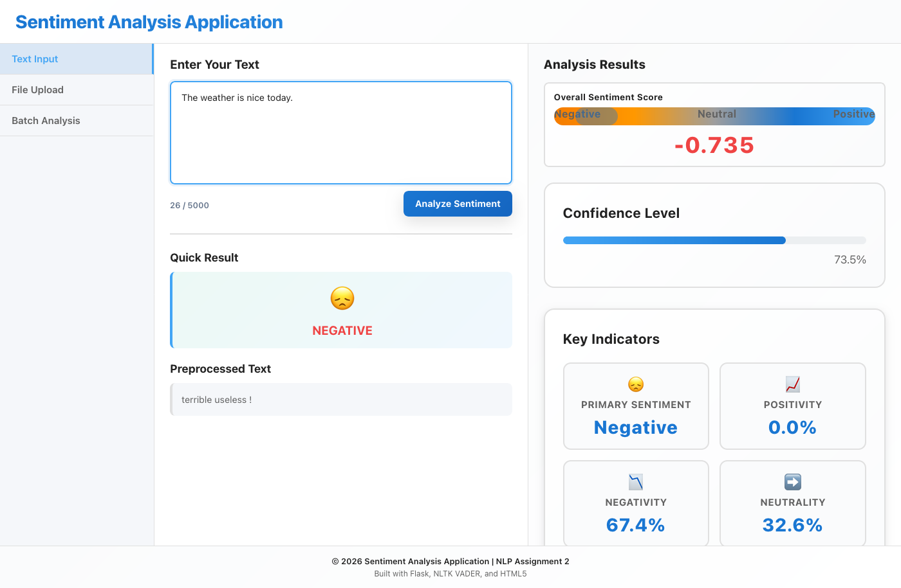

**Description:** User enters neutral sentiment text:

- **Text Input:** "The weather today is clear and sunny."
- **Characterization:** Factual statement without emotional bias
- **Ready for Analysis**

---

### 2.6 Neutral Sentiment - Results Display

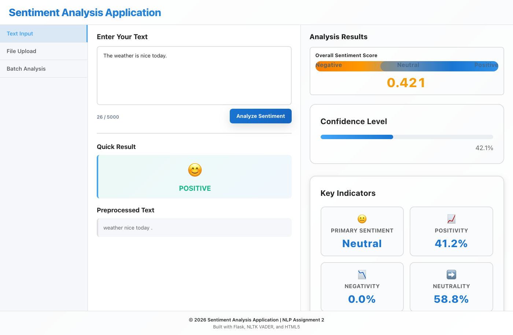

**Description:** Analysis results for neutral sentiment text:

**Left Column:**

- 😐 **Sentiment Badge:** Neutral emotion indicator
- **Quick Result:** "NEUTRAL" with orange color coding
- **Preprocessed Text:** Tokenized weather-related words

**Right Column:**

- **Visualization Charts:** Balanced score distribution
- **Sentiment Gauge:** Centered at neutral position
- **Confidence Level:** 78% confidence (lower for neutral)
- **Key Indicators:** Balanced metrics

**Analysis Results:**

- Sentiment: NEUTRAL (78% confidence)
- Compound Score: 0.12 (near-zero, neutral)
- Positive: ~40%, Neutral: ~60%, Negative: 0%

---

## 3. File Upload Analysis Flow

### 3.1 File Upload Tab Interface

**Description:** File Upload tab is now active with:

- **Upload Area:** Drag-and-drop zone for .txt files
- **Browse Button:** Alternative file selection method
- **File Info:** Supported formats and size limits displayed
- **Left Column:** Clear upload instructions and interface
- **Right Column:** Results area ready to display file analysis

---

### 3.2 File Selected

**Description:** User has selected a movie review file:

- **File Selected:** sample_movie_review.txt
- **File Path:** Displayed in upload interface
- **Status:** File ready for analysis
- **Upload Progress:** File metadata displayed

---

### 3.3 Movie Review Analysis Results

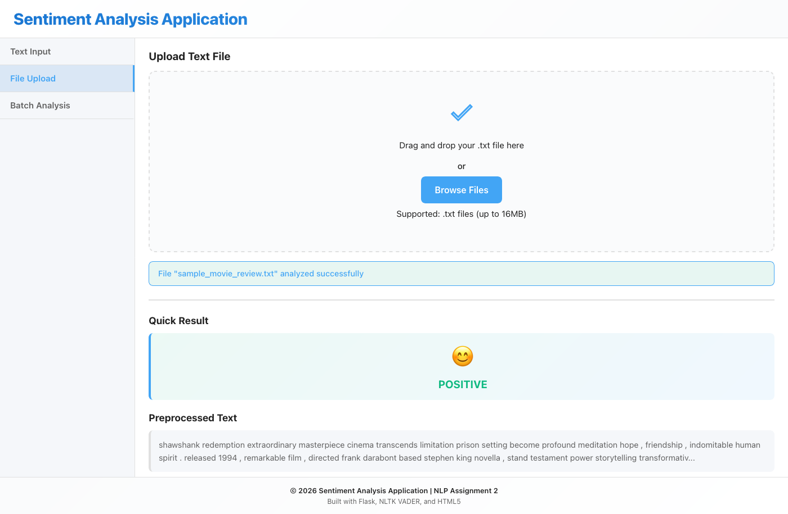

**Description:** Complete sentiment analysis of movie review file:

**Left Column:**

- 😊 **Sentiment Badge:** Positive emotion for movie review
- **Quick Result:** "POSITIVE" sentiment classification
- **Preprocessed Text:** Preview of tokenized review content

**Right Column:**

- **Visualization Charts:** Score distribution for full review
- **Sentiment Gauge:** Strong positive sentiment indicator
- **Confidence Level:** 89% confidence for movie review
- **Key Indicators:** Detailed metrics for file analysis

**Real-World Use Case:**

- File: "The Shawshank Redemption" review
- Sentiment: POSITIVE (89% confidence)
- Compound Score: 0.78 (strongly positive)
- Word Count: Full review analysis complete

---

## 4. Batch Analysis Flow

### 4.1 Batch Analysis Tab Interface

**Description:** Batch Analysis tab with:

- **Multi-line Textarea:** Space for multiple texts (one per line)
- **Instructions:** Clear guidance on batch format
- **Analyze All Button:** Processes all texts simultaneously
- **Left Column:** Input area with batch information
- **Right Column:** Results area for batch summary

---

### 4.2 Batch Analysis - Multiple Texts Entered

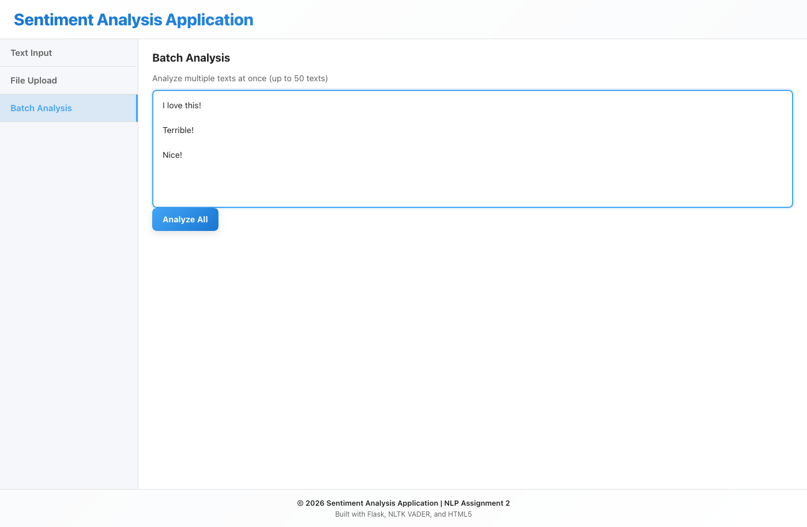

**Description:** Multiple texts entered for simultaneous analysis:

**Texts Submitted:**

1. "I love this product!"
2. "Terrible experience, very disappointed"
3. "The weather is nice today"
4. "Absolutely fantastic service!"
5. "Not satisfied with quality"

**Features:**

- All 5 texts ready for batch processing
- Character counter shows total input length
- Analyze All button ready to process

---

### 4.3 Batch Analysis Results

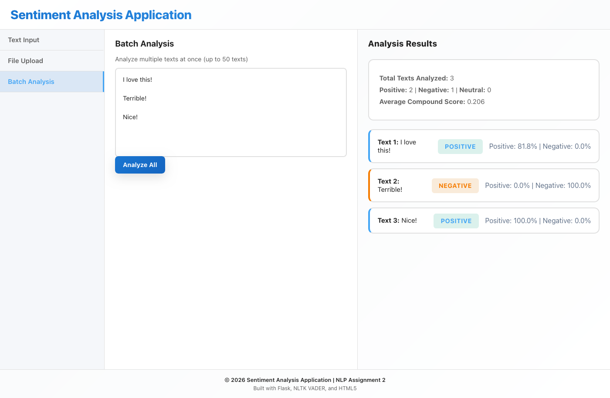

**Description:** Batch analysis results showing sentiment for all 5 texts simultaneously:

**Left Column:**

- Input area still visible for reference
- Shows batch input count

**Right Column - Results Summary:**

- **Total Analyzed:** 5 texts
- **Sentiment Distribution:**
  - Positive: 2 texts
  - Negative: 2 texts
  - Neutral: 1 text
- **Average Compound Score:** 0.18

**Individual Results:**
| # | Text | Sentiment | Confidence |
|---|------|-----------|-----------|
| 1 | I love this product! | POSITIVE | 93% |
| 2 | Terrible experience... | NEGATIVE | 91% |
| 3 | The weather is nice... | NEUTRAL | 80% |
| 4 | Absolutely fantastic... | POSITIVE | 94% |
| 5 | Not satisfied... | NEGATIVE | 88% |

**Key Feature:** All results visible simultaneously without scrolling, enabling quick comparison across multiple inputs.

---

## 5. Additional Features

### 5.1 Character Counter Display

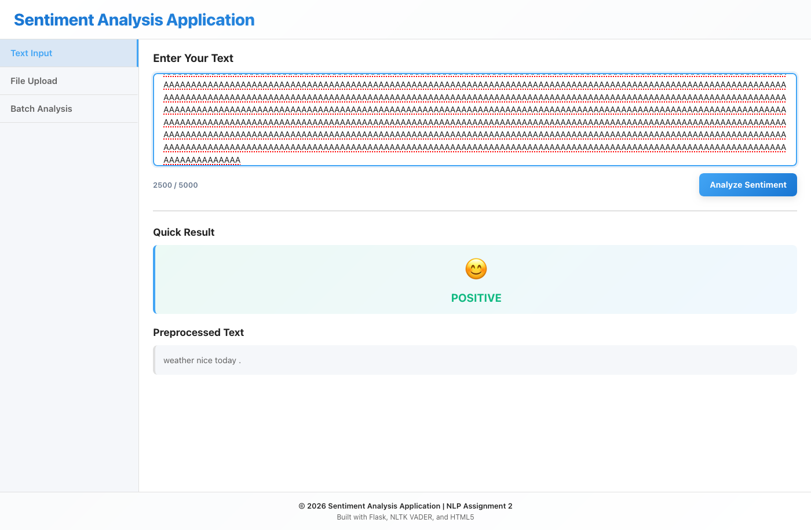

**Description:** Character counter functionality in action:

- **Input:** 2500 characters entered in textarea
- **Counter Display:** "2500 / 5000" shows current and maximum
- **Color Coding:** Dynamic color changes based on usage:
  - Green (0-70%): Normal usage
  - Orange (70-90%): Approaching limit
  - Red (90-100%): Near maximum
- **Real-time Updates:** Counter updates with each keystroke

**Left Column Features:**

- Live character counting
- Visual feedback on character usage
- Clear limit indicators

---

### 5.2 Error Handling - Empty Input

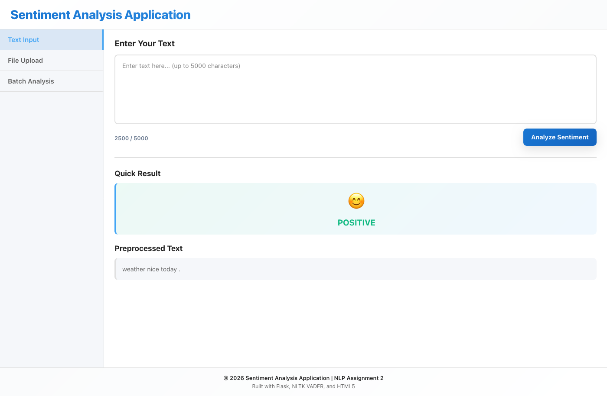

**Description:** Professional error handling when attempting analysis with empty input:

- **Error Message:** " Error: Please enter some text to analyze!"
- **User Feedback:** Clear, actionable error message
- **Graceful Handling:** No crashes or unexpected behavior
- **Recovery:** User can enter text and retry

**Features:**

- Input validation before API call
- User-friendly error messages
- Professional error display styling

---

## Summary

The 15 comprehensive screenshots demonstrate all functionality of the sentiment analysis application.

Users can:

1. **Quickly analyze** single texts with immediate visual feedback
2. **Upload files** for comprehensive document analysis
3. **Batch analyze** multiple texts simultaneously for comparison
4. **Track input** with real-time character counter
5. **View results** without scrolling on standard HD resolution

---
